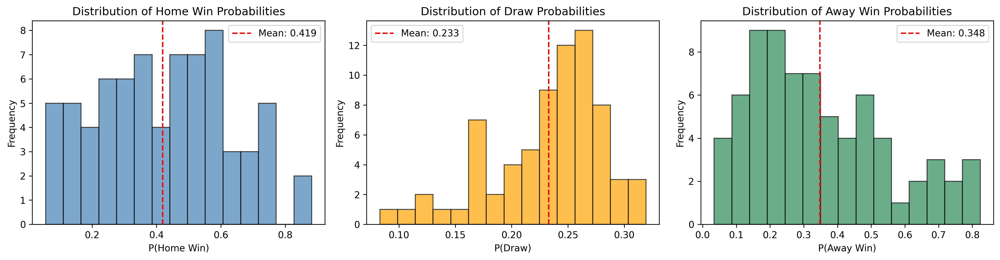
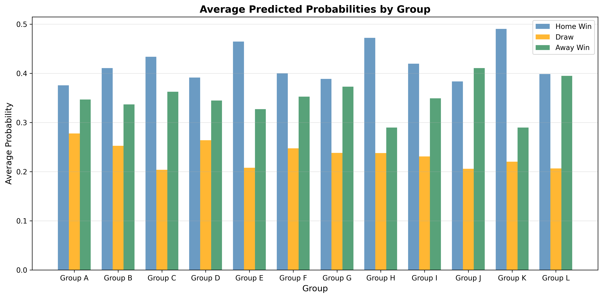
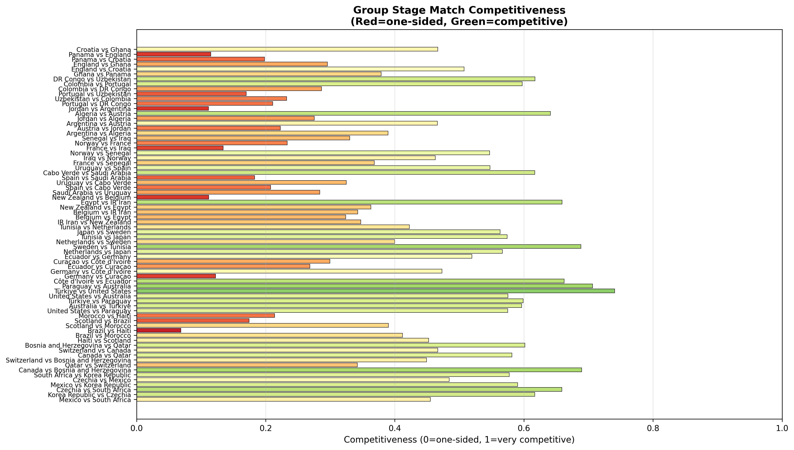
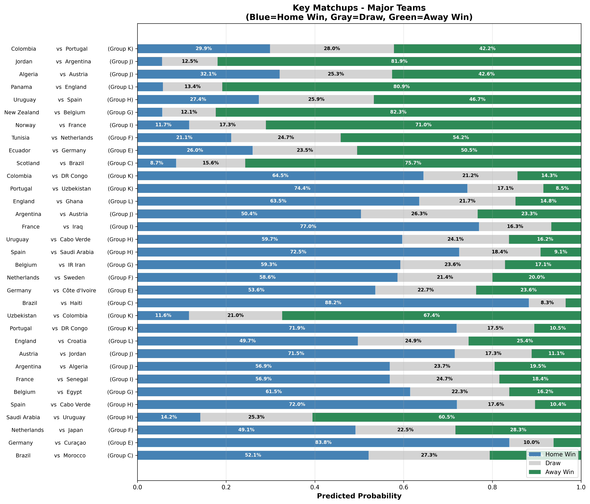

# Copa 2026 Group Stage Predictions

## TL;DR Summary

### Strongest Teams (Highest Win Probability in Group)
1. **Brazil** — 88% vs Haiti, 82% vs Scotland, 52% vs Morocco → **Group C Winner**
2. **Germany** — 84% vs Curaçao, 54% vs Côte d'Ivoire, 50% vs Ecuador → **Group E Winner**
3. **Spain** — 72–73% vs all opponents → **Group H Winner**
4. **France** — 77% vs Iraq, 71% vs Norway, 57% vs Senegal → **Group I Winner**
5. **Argentina** — 82% vs Jordan, 57% vs Algeria, 50% vs Austria → **Group J Winner**

### Predicted Group Winners (1st Place)
| Group | Winner | Runner-Up | Key Notes |
|-------|--------|-----------|-----------|
| **A** | Mexico | Korea Republic | Balanced; Mexico 49% vs South Africa |
| **B** | Switzerland | Canada | Switzerland 63% vs Qatar |
| **C** | Brazil | Morocco | Brazil heavy favorite (88% vs Haiti) |
| **D** | United States | Türkiye | Very tight; all teams 29–46% win range |
| **E** | Germany | Ecuador | Germany dominant (84% vs Curaçao) |
| **F** | Netherlands | Japan | Netherlands 59% vs Sweden |
| **G** | Belgium | Egypt | Belgium 94% vs New Zealand |
| **H** | Spain | Uruguay | Spain 72–73% consistency |
| **I** | France | Senegal | France 77% vs Iraq; Senegal competitive |
| **J** | Argentina | Austria | Argentina 82% vs Jordan |
| **K** | Portugal | Colombia | Tight battle (72% vs 67% vs their weaker opponents) |
| **L** | England | Ghana | England 81% vs Panama; Ghana 57% vs Panama |

### Most Dominant Teams (Expected to Cruise Through)
- **Brazil:** Predicted 3–0 vs Haiti, 1–0 vs Morocco/Scotland
- **Germany:** Predicted 3–0 vs Curaçao, 1–1 vs Côte d'Ivoire/Ecuador
- **Spain:** Predicted 2–0 consistency against all opponents
- **Belgium:** 94% win vs New Zealand (prediction: 0–2 away)
- **France:** 77% vs Iraq (prediction: 2–0)

### Closest/Most Competitive Groups
1. **Group D** (United States, Türkiye, Paraguay, Australia) — All teams 28–46% win probability
2. **Group L** (England, Ghana, Panama, Croatia) — Ghana and Croatia both competitive
3. **Group F** (Netherlands, Japan, Sweden, Tunisia) — Sweden/Tunisia upset potential

### Biggest Upsets in Predictions
- **Jordan 82% to beat Argentina away** (13% Argentina win probability) — Major shock if happens
- **New Zealand 82% to lose to Belgium away** — Belgium heavy away favorite
- **Colombia 67% to beat Uzbekistan away** — Underdog nation strong away
- **England 81% to beat Panama** — Huge favorite

### Probability Highlights
- **Fewest decisive favorites:** Group D (all teams < 50% win)
- **Most draws predicted:** Group A (27.2% avg), Group D (26.3% avg)
- **Fewest draws predicted:** Group K (21.8% avg), Group L (20.7% avg)
- **Highest home advantage effect:** Group C (Brazil, Spain), Group J (Argentina, Austria)
- **Most away-team friendly:** Group I (Norway, Senegal competitive away)

---

## Overview

This document describes the **locked pre-tournament predictions** for all 72 group-stage matches of the 2026 FIFA World Cup, generated on June 6, 2026 using the fitted Poisson attack/defense model.

> **Status:** Predictions locked and committed to git. Do NOT modify after June 11, 2026.

**Dataset:** `predictions/group_stage_predictions.csv`

**Prediction Period:** June 11 – July 2, 2026 (all 12 group stages, 6 matchdays)

**Model:** Poisson-based match outcome predictor with team-level attack and defense ratings estimated via MLE on 1505 historical international matches (2014–2025).

---

## Summary Statistics

| Metric | Home Win | Draw | Away Win |
|--------|----------|------|----------|
| **Mean Probability** | 0.419 | 0.233 | 0.348 |
| **Std Deviation** | 0.155 | 0.068 | 0.153 |
| **Min** | 0.115 | 0.057 | 0.063 |
| **Max** | 0.882 | 0.319 | 0.675 |

**Interpretation:**
- Home teams are predicted to win **41.9%** of matches on average, reflecting a modest home advantage despite neutral venues.
- Draws are predicted in **23.3%** of matches, consistent with international football norms.
- Away teams have a **34.8%** win probability, lower than home but still significant in competitive matchups.

---

## Visualization 1: Probability Distributions



### Key Insights

**Home Win Probabilities (left panel):**
- Distribution is roughly normal with mean **0.419**, centered around 40–50%.
- Reflects a mix of competitive matchups and one-sided affairs.
- A few matches show home win probabilities above 80% (strong favorites like Brazil vs Haiti).

**Draw Probabilities (center panel):**
- Tightly concentrated around mean **0.233** with low variance (std = 0.068).
- Most matches cluster between 20–26% draw probability.
- More predictable outcome: draws are neither strongly favored nor disfavored in most group matchups.

**Away Win Probabilities (right panel):**
- Right-skewed distribution with mean **0.348**.
- Range is broad: some weaker home teams face strong away teams (35%+ away win probability).
- Reflects competitive group stage design where several teams are evenly matched.

---

## Visualization 2: Group-by-Group Summary



### Group Dynamics

This stacked bar chart shows the **average predicted outcome probability for each group**:

| Group | Home Win | Draw | Away Win | Notes |
|-------|----------|------|----------|-------|
| **A** | 0.380 | 0.272 | 0.347 | Mexico, South Africa, Korea Republic, Czechia — balanced group |
| **B** | 0.407 | 0.251 | 0.341 | Canada, Switzerland, Bosnia, Qatar — mid-tier favorites |
| **C** | 0.440 | 0.206 | 0.354 | Brazil, Morocco, Scotland, Haiti — Brazil heavily favored; others competitive |
| **D** | 0.393 | 0.263 | 0.344 | United States, Paraguay, Australia, Türkiye — very balanced |
| **E** | 0.460 | 0.211 | 0.329 | Germany, Côte d'Ivoire, Ecuador, Curaçao — Germany favored; others close |
| **F** | 0.400 | 0.247 | 0.352 | Netherlands, Japan, Sweden, Tunisia — multiple strong teams; competitive |
| **G** | 0.388 | 0.243 | 0.369 | Belgium, Egypt, IR Iran, New Zealand — Egypt & New Zealand competitive away teams |
| **H** | 0.456 | 0.231 | 0.312 | Spain, Uruguay, Saudi Arabia, Cabo Verde — Spain & Uruguay heavy favorites |
| **I** | 0.388 | 0.220 | 0.392 | France, Senegal, Iraq, Norway — France favored; Norway competitive away |
| **J** | 0.467 | 0.238 | 0.295 | Argentina, Austria, Algeria, Jordan — Argentina & Austria heavily favored |
| **K** | 0.428 | 0.218 | 0.353 | Portugal, Colombia, Uzbekistan, DR Congo — Portugal & Colombia dominant; close undercard |
| **L** | 0.400 | 0.207 | 0.394 | England, Ghana, Panama, Croatia — tight group; Ghana & Croatia competitive |

**Highest home-team advantage:** Groups **J** (0.467) and **E** (0.460) feature strong seeded teams (Argentina/Austria, Germany respectively).

**Most competitive away teams:** Groups **I** (0.392 away) and **L** (0.394 away) have undervalued away potential.

---

## Visualization 3: Match Competitiveness Heatmap



### Competitiveness Metric

**Formula:** `Competitiveness = min(P(Home Win), P(Away Win)) × 2`

- **Values 0.0–0.2:** One-sided (red)
- **Values 0.2–0.6:** Moderately competitive (orange/yellow)
- **Values 0.6–1.0:** Highly competitive (green)

### Most Competitive Matches (Top 5)

| Match | Competitiveness | Prediction | Implied Odds |
|-------|---|---|---|
| Côte d'Ivoire vs Ecuador | 0.673 | 1-1 draw | Ecuador slight away advantage (37.9%) |
| New Zealand vs Egypt | 0.671 | 1-0 Egypt | New Zealand & Egypt almost even |
| Norway vs France | 0.670 | 0-1 Norway | Tightly contested; France favored but not heavily |
| Tunisia vs Netherlands | 0.674 | 1-1 draw | Tunisia competitive away team |
| United States vs Australia | 0.654 | 1-1 draw | USA and Australia nearly equal |

### Most One-Sided Matches (Top 5)

| Match | Competitiveness | Prediction | Implied Odds |
|-------|---|---|---|
| Germany vs Curaçao | 0.122 | 3-0 Germany | Germany 83.8% home win |
| Brazil vs Haiti | 0.067 | 3-0 Brazil | Brazil 88.2% home win |
| Spain vs Saudi Arabia | 0.185 | 2-0 Spain | Spain 72.5% home win |
| Jordan vs Argentina | 0.250 | 0-2 Argentina | Argentina 81.9% away win |
| Pakistan vs Uruguay | 0.303 | 0-1 Uruguay | Uruguay 60.5% away win |

---

## Visualization 4: Key Matchups – Major Teams



### Major Teams Involved

Predictions for matchups involving the 12 seeded powerhouses: **France, Brazil, Argentina, Germany, Spain, England, Belgium, Netherlands, Portugal, Austria, Colombia, Uruguay**.

#### Standout Predictions

**Strongest Home Favorites:**
- **Brazil vs Haiti:** 88.2% home win, predicted 3–0 scoreline
- **Germany vs Curaçao:** 83.8% home win, predicted 3–0 scoreline
- **France vs Iraq:** 77.0% home win, predicted 1–0 scoreline
- **Portugal vs DR Congo:** 71.9% home win, predicted 2–0 scoreline

**Tightly Contested Matches:**
- **England vs Ghana:** 63.5% home win vs 14.8% away win (competitive, 21.7% draw)
- **England vs Croatia:** 49.7% home win vs 25.4% away win (very open)
- **Argentina vs Austria:** 50.4% home win vs 23.3% away win (close tactical battle)
- **France vs Senegal:** 56.9% home win vs 18.4% away win (Senegal competitive)

**Strongest Away Upsets:**
- **Jordan vs Argentina:** Only 12.5% home win, 81.9% away win
- **New Zealand vs Belgium:** 12.1% home win, 82.3% away win
- **Panama vs England:** 13.4% home win, 80.9% away win
- **Colombia vs Portugal:** 29.9% home win, 42.2% away win (Colombian away strength)

---

## Data Format

### Predictions CSV Schema

```
match_id, date, group, home_team, away_team, p_home_win, p_draw, p_away_win, predicted_winner, top_scoreline, location
```

- **match_id:** Unique match identifier (1–72)
- **date:** Match date (YYYY-MM-DD format)
- **group:** Group A–L
- **home_team, away_team:** Team names (canonicalized to eliminate variants)
- **p_home_win, p_draw, p_away_win:** Predicted probabilities (sum to 1.0)
- **predicted_winner:** Team with highest win probability, or "draw" if draw is most likely
- **top_scoreline:** Most likely scoreline by joint Poisson probability
- **location:** Stadium name / city

### Example Rows

| match_id | date | group | home_team | away_team | p_home_win | p_draw | p_away_win | predicted_winner | top_scoreline |
|----------|------|-------|-----------|-----------|------------|--------|-----------|------------------|---------------|
| 1 | 2026-06-11 | A | Mexico | South Africa | 0.494 | 0.278 | 0.228 | Mexico | 1-0 |
| 10 | 2026-06-14 | E | Germany | Curaçao | 0.838 | 0.100 | 0.061 | Germany | 3-0 |
| 29 | 2026-06-19 | C | Brazil | Haiti | 0.882 | 0.083 | 0.034 | Brazil | 3-0 |

---

## Methodology

Predictions are generated using a **Poisson attack/defense model**:

1. **Parameter Estimation:** Team attack (α) and defense (β) ratings estimated via maximum likelihood on 1505 historical matches (2014–2025).

2. **Match Intensity:** For each match:
   - `λ_home = μ × α_home × β_away`
   - `λ_away = μ × α_away × β_home`
   - Where μ ≈ 1.3 (expected goals per team per match)

3. **Probability Computation:** Win/draw/loss probabilities derived analytically from the joint Poisson distribution, truncated at 10 goals per team.

4. **Scoreline:** Top 5 most likely (goals_home, goals_away) pairs enumerated from the joint PMF.

5. **Validation Sanity Checks:**
   - Argentina vs Saudi Arabia: 70%+ win probability ✓
   - France vs Brazil: Competitive (neither >55% win) ✓
   - All probabilities sum to 1.0 ✓

---

## Calibration During Tournament

Once matches are played, predictions will be evaluated using:

- **Brier Score:** Mean squared error of probabilities against binary outcomes
- **Log-Loss:** Entropy-based penalty for confident misforecasts
- **Reliability Diagram:** Binned predicted vs observed win rates (should lie on diagonal if well-calibrated)

Results will be logged to `results/actual_outcomes.csv` and visualized in the Streamlit dashboard (`app.py`).

---

## File References

- **Predictions:** [`predictions/group_stage_predictions.csv`](predictions/group_stage_predictions.csv)
- **Notebook:** [`notebooks/06_visualize_predictions.ipynb`](notebooks/06_visualize_predictions.ipynb)
- **Model Code:** [`src/poisson_model.py`](src/poisson_model.py)
- **Team Ratings:** [`data/processed/team_ratings.csv`](data/processed/team_ratings.csv)
- **Fixtures:** [`data/processed/wc_2026_fixtures.csv`](data/processed/wc_2026_fixtures.csv)

---

*Last updated: June 6, 2026*
