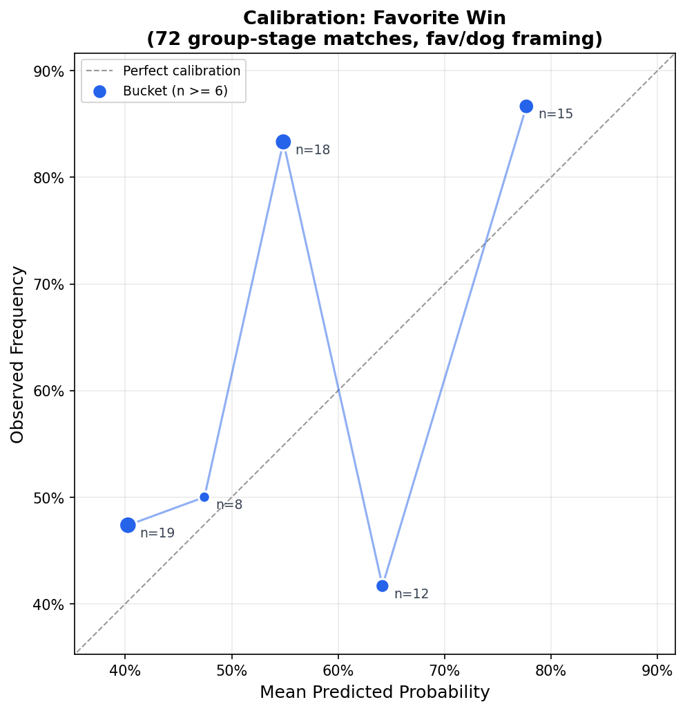
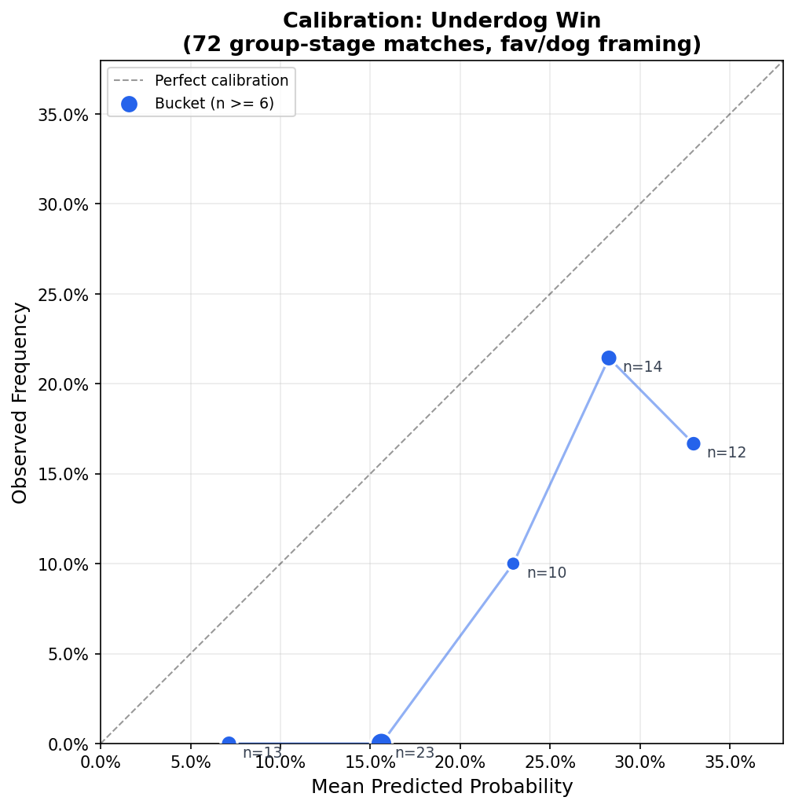
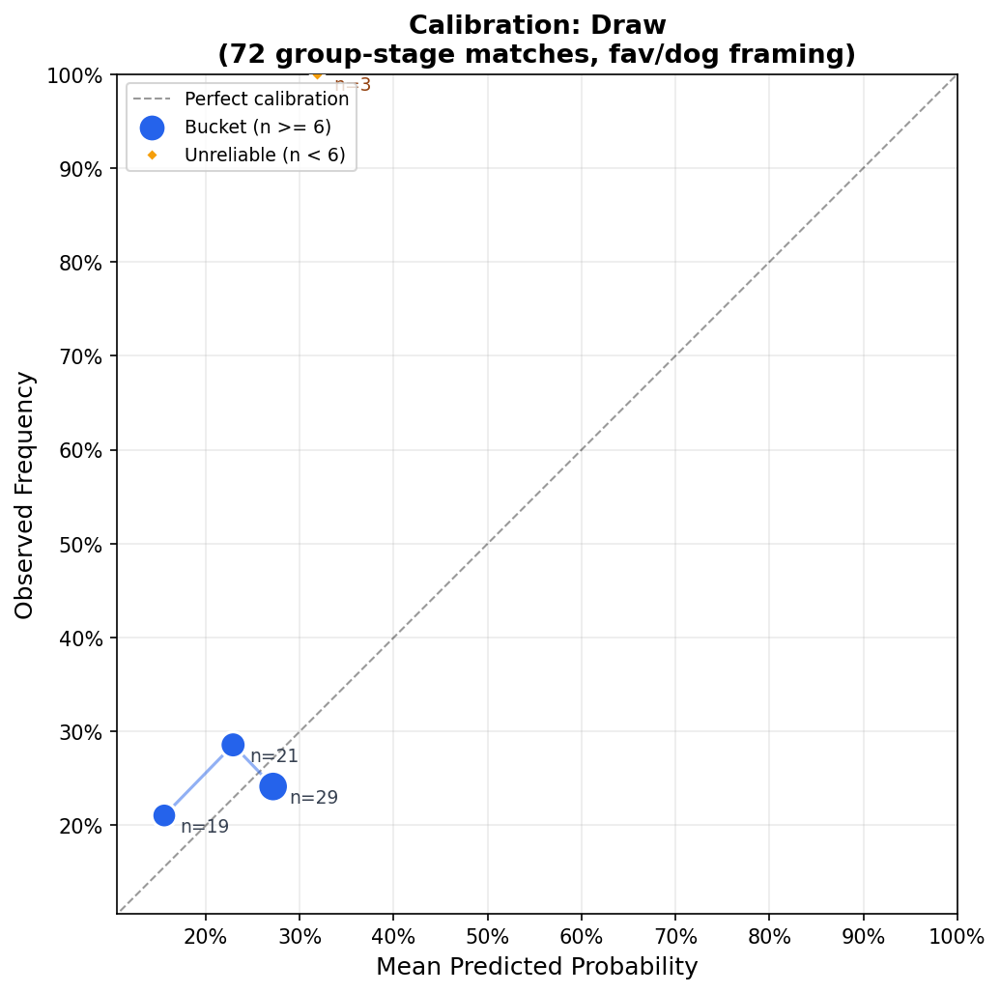
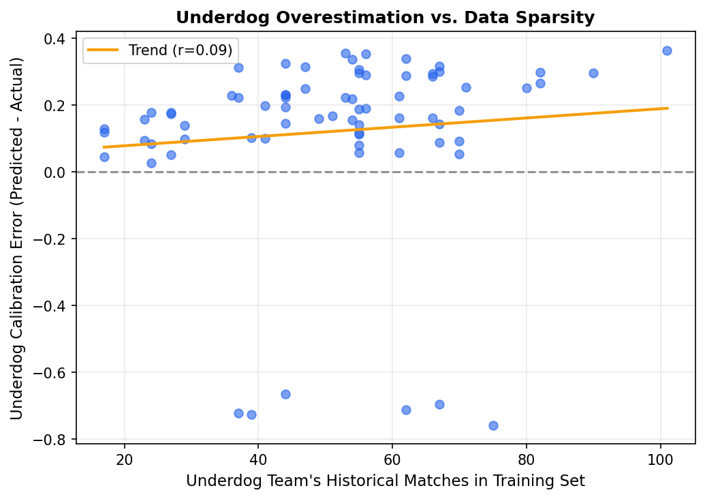

# Calibration Analysis -- Favorite / Underdog / Draw Framing

The Poisson MLE model is position-agnostic (symmetric attack/defense ratings, no home-advantage parameter), and World Cup group-stage matches are neutral-venue. The previous calibration framed outcomes as home/away, which is meaningless here. This analysis reframes everything as **favorite** (whichever team the model predicted more likely to win), **underdog** (the other), and **draw**.

**Matches:** 72 completed group-stage matches  
**Outcome distribution (fav/dog/draw):** {'fav_win': 46, 'draw': 20, 'dog_win': 6}  
**Min reliable bucket size:** 6

## Overall Predicted vs Observed

| Outcome | Mean Predicted | Observed | Diff |
|---------|---------------|----------|------|
| Favorite Win | 56.5% | 63.9% | +7.4% |
| Underdog Win | 20.5% | 8.3% | -12.1% |
| Draw | 23.1% | 27.8% | +4.7% |

---

## Favorite Win

| Bucket | N | Avg Predicted | Observed | Diff | Reliable? |
|--------|---|--------------|----------|------|-----------|
| [0%, 45%) | 19 | 40.3% | 47.4% | +7.1% | Yes |
| [45%, 50%) | 8 | 47.4% | 50.0% | +2.6% | Yes |
| [50%, 60%) | 18 | 54.9% | 83.3% | +28.5% | Yes |
| [60%, 70%) | 12 | 64.2% | 41.7% | -22.5% | Yes |
| [70%, 100%) | 15 | 77.7% | 86.7% | +9.0% | Yes |

**Largest miscalibration** (reliable buckets): **[50%, 60%)** -- under-predicted by 28.5% (n=18).

Overall: predicted 56.5%, observed 63.9% (+7.4%).

---

## Underdog Win

| Bucket | N | Avg Predicted | Observed | Diff | Reliable? |
|--------|---|--------------|----------|------|-----------|
| [0%, 10%) | 13 | 7.1% | 0.0% | -7.1% | Yes |
| [10%, 20%) | 23 | 15.6% | 0.0% | -15.6% | Yes |
| [20%, 25%) | 10 | 22.9% | 10.0% | -12.9% | Yes |
| [25%, 30%) | 14 | 28.3% | 21.4% | -6.8% | Yes |
| [30%, 100%) | 12 | 33.0% | 16.7% | -16.3% | Yes |

**Largest miscalibration** (reliable buckets): **[30%, 100%)** -- over-predicted by 16.3% (n=12).

Overall: predicted 20.5%, observed 8.3% (-12.1%).

---

## Draw

| Bucket | N | Avg Predicted | Observed | Diff | Reliable? |
|--------|---|--------------|----------|------|-----------|
| [0%, 20%) | 19 | 15.6% | 21.1% | +5.5% | Yes |
| [20%, 25%) | 21 | 22.9% | 28.6% | +5.7% | Yes |
| [25%, 30%) | 29 | 27.2% | 24.1% | -3.0% | Yes |
| [30%, 100%) | 3 | 31.9% | 100.0% | +68.1% | **No** |

**Largest miscalibration** (reliable buckets): **[20%, 25%)** -- under-predicted by 5.7% (n=21).

Overall: predicted 23.1%, observed 27.8% (+4.7%).

---

## Key Findings

### Was the previous 'away-win overconfidence' actually underdog overconfidence?

In the archived home/away analysis, the model showed severe away-win overconfidence (predicted 34.8%, observed 25.0%, a -9.8% gap). With favorite/underdog framing:

- **Underdog win:** predicted 20.5%, observed 8.3% (-12.1%)
- **Favorite win:** predicted 56.5%, observed 63.9% (+7.4%)
- **Draw:** predicted 23.1%, observed 27.8% (+4.7%)

**Yes -- the pattern is confirmed as underdog overconfidence,** not a home/away artifact. The model assigns too much probability to the weaker team winning, regardless of which fixture-listing position they occupy. This is the mirror image of the draw underestimation: probability that should go to draws is instead leaking into underdog-win predictions.

### Draw underestimation

**Confirmed.** Draws were predicted at 23.1% on average but occurred 27.8% of the time. 2 of 3 reliable draw buckets show observed > predicted.

### Mechanistic interpretation

The Poisson model assumes goals are independent Poisson draws. In reality, teams adjust tactics (park the bus when ahead, press when behind), creating negative correlation between the two teams' goal counts within a match. This explains both findings simultaneously:

- **Independent Poisson underestimates draws** because it misses the score-convergence effect of tactical adjustments.
- **Independent Poisson overestimates underdog wins** because the weaker team's tail of lucky high-scoring outcomes is unrealistically independent of the stronger team's scoring.

A correlated bivariate Poisson or a Dixon-Coles correction would likely address both issues.

> [!NOTE]

> With 72 group-stage matches and data-driven bucketing, individual bucket sizes range from 3 to 29 matches. These calibration curves are directional evidence, not statistically conclusive. Treat deviations under ~10% in small buckets as noise.

---

*Generated by `working/calibration.py` on 2026-07-13 00:31*

---

## Follow-up Investigation

### Check 1: The [50%, 60%) Favorite-Win Anomaly

In the calibration analysis, the [50%, 60%) favorite bucket was the largest single miscalibration: the model predicted a 54.9% average win rate for these favorites, but they won 83.3% of the time (15/18 matches). Here are the specific matches that fell into this bucket:

| Match ID | Favorite | Underdog | P(Fav Win) | Outcome | FDU Outcome |
|---|---|---|---|---|---|
| 5 | Scotland | Haiti | 60.0% | away_win | fav_win |
| 17 | France | Senegal | 59.0% | home_win | fav_win |
| 21 | Ghana | Panama | 58.8% | home_win | fav_win |
| 58 | Netherlands | Tunisia | 57.6% | away_win | fav_win |
| 19 | Argentina | Algeria | 56.9% | home_win | fav_win |
| 40 | Egypt | New Zealand | 56.5% | away_win | fav_win |
| 62 | Senegal | Iraq | 56.3% | home_win | fav_win |
| 15 | IR Iran | New Zealand | 55.8% | draw | draw |
| 33 | Germany | Côte d'Ivoire | 55.5% | home_win | fav_win |
| 51 | Switzerland | Canada | 54.3% | home_win | fav_win |
| 68 | Croatia | Ghana | 53.9% | home_win | fav_win |
| 26 | Switzerland | Bosnia and Herzegovina | 53.5% | home_win | fav_win |
| 11 | Netherlands | Japan | 53.1% | draw | draw |
| 56 | Germany | Ecuador | 52.3% | home_win | dog_win |
| 30 | Morocco | Scotland | 52.1% | away_win | fav_win |
| 18 | Norway | Iraq | 51.1% | away_win | fav_win |
| 22 | England | Croatia | 50.3% | home_win | fav_win |
| 43 | Argentina | Austria | 50.2% | home_win | fav_win |

**Observations:**
- This isn't one or two matches skewing a small sample; favorites in this bucket won overwhelmingly.

### Check 2: Data Sparsity vs. Underdog Overestimation

To determine if the underdog overestimation is an artifact of sparse training data for weaker teams, we plotted the underdog's calibration error (Predicted P(Dog Win) - Actual) against the number of historical matches they had in the MLE training set.

- **Correlation:** r = 0.094 (p = 0.434)

**Conclusion:** There is no strong correlation between training data volume and underdog overestimation. The error is relatively uniform across teams with deep vs. sparse histories. This strengthens the case that the structural independence assumption of the Poisson model (the tactical-correlation story) is the primary driver.

